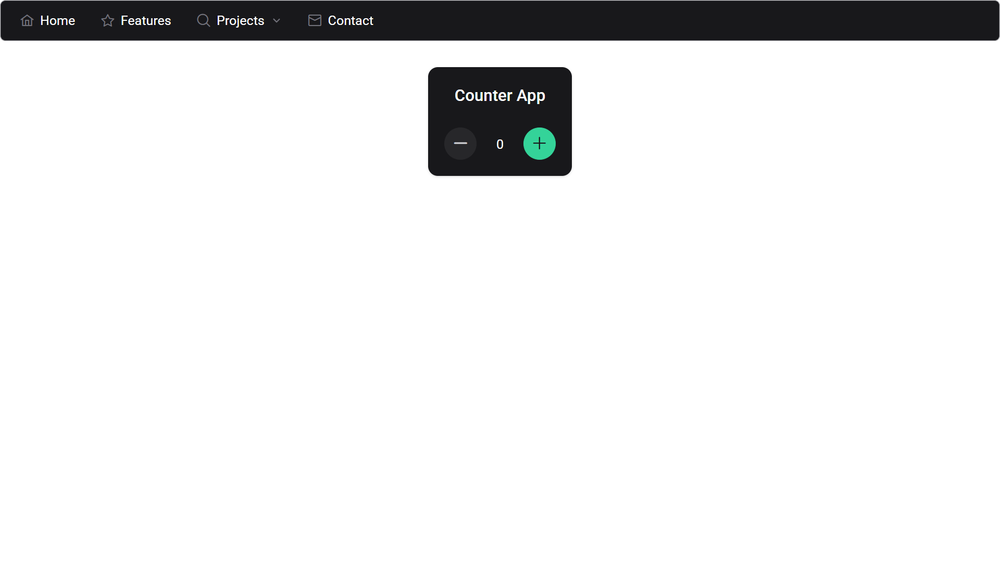

# 🚀 NgSkillLab

NgSkillLab is a personal Angular project repository where I implement and experiment with all the features I'm learning in Angular. It serves as a hands-on learning lab to master Angular concepts, state management, UI libraries, and best practices.

---



## 📦 Tech Stack

- **Angular** (latest)
- **NgRx** – Reactive State Management
- **Bootstrap** – CSS Framework
- **Angular Material** – Material Design Components
- **PrimeNG** – Advanced UI Components

---

## ✅ Features Implemented

- ✅ **NgRx Store Setup**
  - Actions, Reducer, Selectors
  - Counter state management
- ✅ **Component-based architecture**
- ✅ **Modular folder structure**
- ✅ **UI libraries installed and ready**

---

## 🔧 Project Setup

```bash
# Clone the repository
git clone https://github.com/rahulrgd18/NgSkillLab.git
cd NgSkillLab

# Install dependencies
npm install

# Run the development server
ng serve

src/
│
├── app/
│   ├── features/
│   │   └── counter/
│   │       ├── actions/
│   │       ├── reducers/
│   │       ├── selectors/
│   │       └── counter.component.ts
│   └── shared/
│
├── assets/
└── environments/
